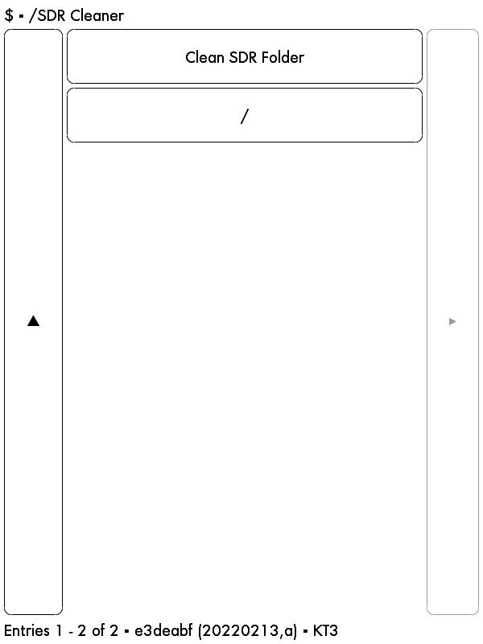

# Kindle SDR Cleaner Script

Clean up useless `.sdr` folders in your Kindle through the `bash`.

Jailbreaking and installing [KUAL](https://www.mobileread.com/forums/showthread.php?t=203326) is required

## Installation

Download, unzip, and move the folder into the `extensions`

Note: The script will not print the information, just click

# Screenshot

